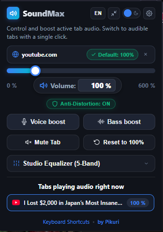
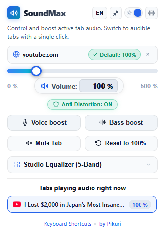
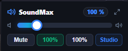
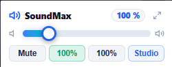
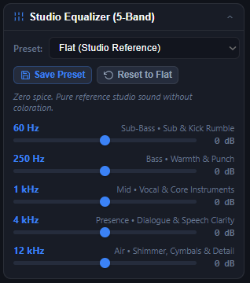

# SoundMax - Tab Audio Booster & Studio Equalizer

<p align="center">
  <a href="https://github.com/Pikurii/soundmax-volume-booster/raw/main/soundmax-extension.zip">
    
  </a>
  <a href="https://ko-fi.com/pikurii" target="_blank">
    
  </a>
  <a href="https://tako.id/Pikuri" target="_blank">
    
  </a>
</p>

<p align="center">
  <a href="https://developer.chrome.com/docs/extensions/mv3/"></a>
  <a href="LICENSE"></a>
  <a href="https://github.com/Pikurii/soundmax-volume-booster"></a>
</p>

SoundMax is a browser extension for Chromium browsers (Google Chrome, Opera GX, Microsoft Edge, Brave, and Vivaldi) that lets you control and boost individual tab audio up to 600% (or up to 800% in Turbo Mode). It includes a 5-band studio parametric equalizer, an anti-distortion limiter, domain-specific volume defaults, dual layout modes, and real-time synchronization with native browser tab controls.

Built strictly under Manifest V3 specifications with an on-demand, zero-leak resource architecture that ensures 0.0% CPU and 0 MB audio memory usage when idle.

---

## Interface Previews

### Studio Mode (Full Experience)
Comprehensive audio workstation with volume control, quick boost buttons, active site default strip, 5-band equalizer, and live audible tab switcher.

<p align="center">
  
  &nbsp;
  
</p>

### Mini Mode (Compact View)
Streamlined layout (~250px x 95px) for quick volume adjustments, 1-click mute, site defaults, and 100% reset without cluttering the screen.

<p align="center">
  
  &nbsp;
  
</p>

### 5-Band Studio Parametric Equalizer
Five precision frequency bands with studio presets, custom preset saving, and real-time Web Audio DSP filtering.

<p align="center">
  
</p>

---

## Core Features

### Audio Amplification & Direct Input
- Boost volume smoothly from 0% up to 600% (expandable to 800% via Turbo Mode in Settings).
- Type exact volume percentages directly into the numeric input box (e.g., `125`, `250`, `450`) and press Enter.
- Smooth analog-style gain ramping eliminates volume spikes and audio popping when scrubbing the slider.
- Mouse wheel scrolling over the volume slider area lets you adjust volume in 5% steps.

### 5-Band Studio Parametric Equalizer
Fine-tune individual frequency bands using Web Audio API biquad filters:
- **60 Hz (Sub-Bass Low Shelf)**: Subwoofer depth, kick drums, and low-frequency rumble.
- **250 Hz (Bass Peaking)**: Warmth, bass guitar clarity, and vocal lower body.
- **1 kHz (Mid Peaking)**: Core speech clarity, vocal intelligibility, and instruments.
- **4 kHz (Presence Peaking)**: Speech articulation, crisp dialogue, and detail.
- **12 kHz (Treble High Shelf)**: Acoustic sparkle, cymbals, air, and breath.
- Built-in reference presets: Flat, Bass Booster, Vocal Clarifier, Rock & Punch, and Night Mode.
- Save unlimited custom named presets directly to browser storage.

### Adaptive Smart Limiter (Anti-Distortion)
- Dynamic brickwall compressor (-1.5 dBFS) paired with analog tape soft-clipping saturation.
- Prevents harsh digital clipping and speaker crackle at extreme boost levels.
- Automatically bypasses polyphase oversampling when volume is at or below 100% to save CPU cycles.

### Per-Site Volume & EQ Profiles
- Save unique volume and equalizer settings for specific websites (e.g., set YouTube to 180% with Vocal Boost, while keeping Netflix at 100% Flat).
- SoundMax recognizes the website domain and applies the saved profile automatically when the page loads.
- Visual badge indicator displays active site settings, with a single-click update button when adjusting volume on a saved domain.
- Saved Sites Manager in Settings allows viewing, editing, or clearing stored domain profiles.

### Dual Interface Modes
- **Studio Mode**: Full control panel featuring the complete 5-band equalizer, quick presets, site configuration strip, and live audio tab list.
- **Mini Mode**: Compact, distraction-free widget focused on fast slider adjustments, mute toggling, and preset switching.
- Switch between modes with a single click, or set your preferred default mode in Settings.

### Browser Tab Synchronization & Audible Tab Switcher
- Real-time two-way synchronization with native browser tab controls (including Opera GX and Chrome tab mute buttons).
- Live audible tab scanner identifies all tabs currently outputting sound across windows and lets you switch to any tab with one click.
- Automatic gain handoff prevents volume explosions when refreshing video streams or navigating within YouTube.

### Backup & Restore
- Export all settings, saved site profiles, and custom EQ presets into a clean `.json` file.
- Restore configuration anytime with one-click import.

### Bilingual Support
- Complete UI localization for English and Bahasa Indonesia.
- Switch languages instantly from the header toggle button or the Settings menu.

---

## Performance & Resource Management

SoundMax was written specifically to avoid common extension issues such as background battery drain, dangling audio contexts, or residual memory usage.

### 1. On-Demand Offscreen Lifecycle
Under Chrome Manifest V3, Web Audio processing requires an offscreen document. Rather than keeping an offscreen document running permanently:
- No offscreen document is created on browser startup.
- The offscreen document is initialized only when volume is boosted or when the popup opens.
- When all boosted tabs are closed or reset to 100%, an idle timer (20 seconds) automatically terminates the offscreen document via `chrome.offscreen.closeDocument()`.
- **Result**: Memory usage drops to 0 MB and the offscreen process disappears completely from the browser task manager when not in active use.

### 2. 0.0% Idle CPU Suspension
- If audio is unboosted or paused, the underlying `AudioContext` is suspended. Suspending the context halts Chromium's hardware audio rendering thread completely, guaranteeing 0.0% CPU usage.

### 3. Complete Graph Deallocation
- When a captured tab is closed, all associated media stream tracks are stopped (`track.stop()`), all 10 audio nodes (`source`, 5 biquad filters, `gainNode`, `compressor`, `softClipper`, `outputGain`) are disconnected, and references are cleared to permit immediate garbage collection.

### 4. Controlled IPC & Throttled Rendering
- Slider movement is throttled to ~28 fps (35ms) to prevent message flooding across browser processes.
- Tab scanner polling uses signature memoization to avoid layout thrashing and DOM redraws when tab states have not changed.

---

## Keyboard Shortcuts

| Shortcut | Action |
| :--- | :--- |
| `Alt + V` | Open SoundMax popup |
| `Alt + Up` | Increase active tab volume (+10%) |
| `Alt + Down` | Decrease active tab volume (-10%) |
| `Alt + M` | Toggle Mute / Unmute |
| `0` to `6` *(in popup)* | Jump directly to 0%, 100%, 200%, ..., 600% |
| `Up` / `Down` *(in popup)* | Adjust volume in 10% steps |
| `Enter` *(in number box)* | Apply typed volume percentage |

To modify shortcuts in your browser:
- **Chrome / Brave / Edge**: Open `chrome://extensions/shortcuts`
- **Opera / Opera GX**: Open `chrome://extensions/shortcuts` (standard Chromium shortcut manager)

---

## Installation

### Method 1: Pre-packaged ZIP (Ready to Use)
1. Download [`soundmax-extension.zip`](https://github.com/Pikurii/soundmax-volume-booster/raw/main/soundmax-extension.zip).
2. Extract the ZIP file into a folder on your computer.
3. Open your browser and navigate to `chrome://extensions` (or `edge://extensions`).
4. Enable **Developer mode** using the toggle switch in the upper-right corner.
5. Click **Load unpacked** and select the extracted folder.
6. Pin SoundMax to your toolbar for quick access.

### Method 2: Clone from Repository
```bash
git clone https://github.com/Pikurii/soundmax-volume-booster.git
```
In `chrome://extensions`, enable **Developer mode**, click **Load unpacked**, and select the cloned directory.

---

## Privacy Policy

SoundMax was built with a privacy-first, offline-only architecture:

1. **Zero Data Collection**: SoundMax does not collect, log, track, store, or transmit any user data, URLs, browsing history, search terms, or audio stream content.
2. **100% Local Processing**: All audio amplification, filtering, and equalization happen entirely within your local browser process using the standard Web Audio API. Audio buffers never leave your machine.
3. **No External Network Requests**: The extension contains zero third-party analytics scripts, zero tracking pixels, zero external dependencies, and makes no remote network calls (`fetch` or `XMLHttpRequest`).
4. **Local Configuration Storage**: Your saved volume settings, domain profiles, and custom EQ presets are stored strictly inside your browser's local sandbox (`chrome.storage.local`). They are never synchronized to external servers.
5. **Minimal Permissions**: The extension requests only permissions strictly necessary for its functionality:
   - `tabCapture`: To route tab audio through the Web Audio equalization graph.
   - `offscreen`: To host the Web Audio API context in accordance with Manifest V3 requirements.
   - `storage`: To save your preferences locally.
   - `tabs`: To read tab audio state, title, and domain name for site-specific profiles.

---

## Project Structure

```text
soundmax-volume-booster/
├── manifest.json            # Extension configuration (Manifest V3)
├── background.js           # Background service worker (state sync, on-demand lifecycle)
├── offscreen/
│   ├── offscreen.html      # Offscreen DOM host for Web Audio API
│   └── offscreen.js        # DSP Audio Engine: 5-Band EQ, limiter, 0.0% CPU suspend
├── popup/
│   ├── popup.html          # Dual Mode UI (Mini & Studio views)
│   ├── popup.css           # Modern glassmorphism stylesheet (Dark & Light)
│   └── popup.js            # UI controller, state sync & preset manager
├── icons/                  # Vector & raster extension icons (16, 32, 48, 128 px)
├── assets/
│   └── screenshots/        # Interface preview screenshots (Studio, Mini, Equalizer)
├── dev-tools/              # Local preview web server and audio test bench
├── soundmax-extension.zip  # Pre-built distribution package
├── LICENSE                 # MIT License (c) 2026 Pikuri
└── README.md               # Documentation
```

---

## Author & License

- **Author**: Pikuri ([@Pikurii](https://github.com/Pikurii))
- **Repository**: [https://github.com/Pikurii/soundmax-volume-booster](https://github.com/Pikurii/soundmax-volume-booster)
- **Support**: [Ko-fi](https://ko-fi.com/pikurii) | [Tako.id](https://tako.id/Pikuri)
- **License**: Released under the [MIT License](LICENSE).
